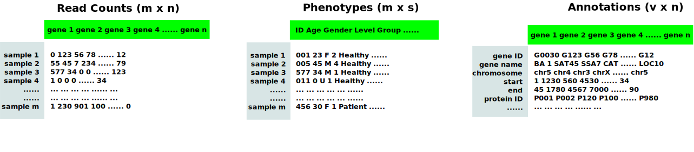
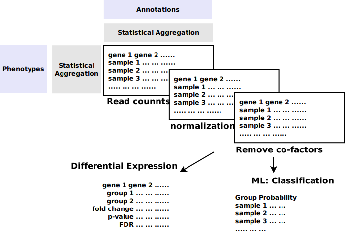
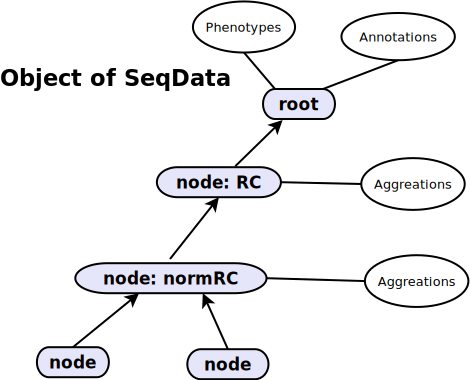

# ernav2_seqdata
A new data type known as SeqData is designed for RNA-seq data analysis. The data type is designed for integration of varous data set from various sources and dimensions:



Expression of RNA is measured by read counts of transcripts. A typical bioinformatics pipeline of mRNA-seq determines reads counts (RC) of transcripts. The RCs are typically 2-D table, of which samples are in rows, and transcripts (or genes) are in columns, or in the reverse. After that, the RC table would be normalized as FPM or FPKM or somewhere else by a certain normalized method. The next, co-founding factors among samples would be removed using a certain method namely DESEQ2 or EdgeR etc. Moreover, those data would be transformed into various table, namely log, or partitioned into some subset. Bioinformatician should manage all those data sets during statistical anlaysis.



Biological scientists may be more care about significance of mRNA-seq data analysis, and what those significance reveals. In this case, sample informations, or patient information, or features of samples (namely single cells) shall be considered. Moreover, aside from transcript ID or Gene ID, other annotations would be integrated, for example, genomic annoations namely chromosome locus, protein annotations namely domain identification would be integrated, too. Those annoation data may not be used in statistical process, but really needed for further study.



## Development
Run unit testings
```
pytest tests/unittests
```

## installation


